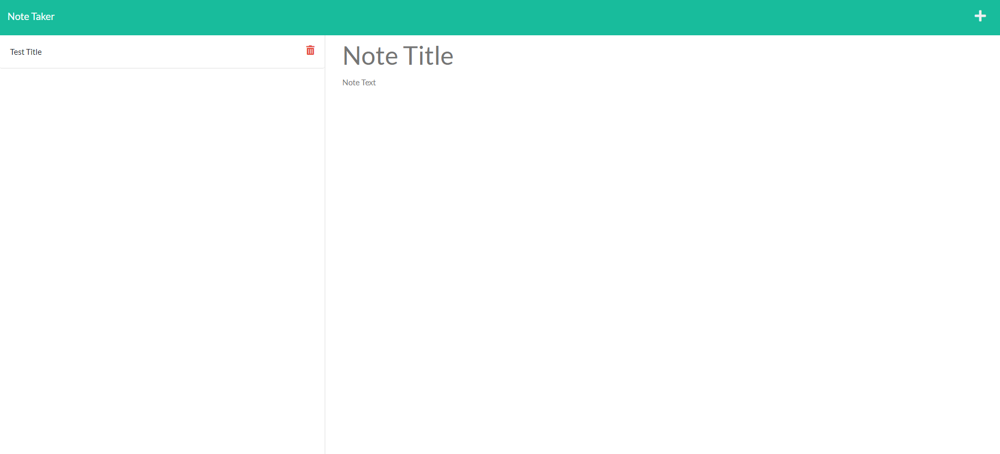

# Note Taker
## Code quiz with highscores
 

### Once opening the URL, you will be taken to a landing page with a title of "Note Taker", a description of "Take notes with Express", and a button that says "Get Started."

### When Get Started is clicked, you will be brought to a new page (url will add "/notes") with a note title and text, and saved notes to the left.
### You can create new notes, save them, then delete them.
 

# Screenshot Below:

 
 

# URL Links:
 
## Note Taker on Heroku: https://desolate-beach-88553.herokuapp.com/ 
